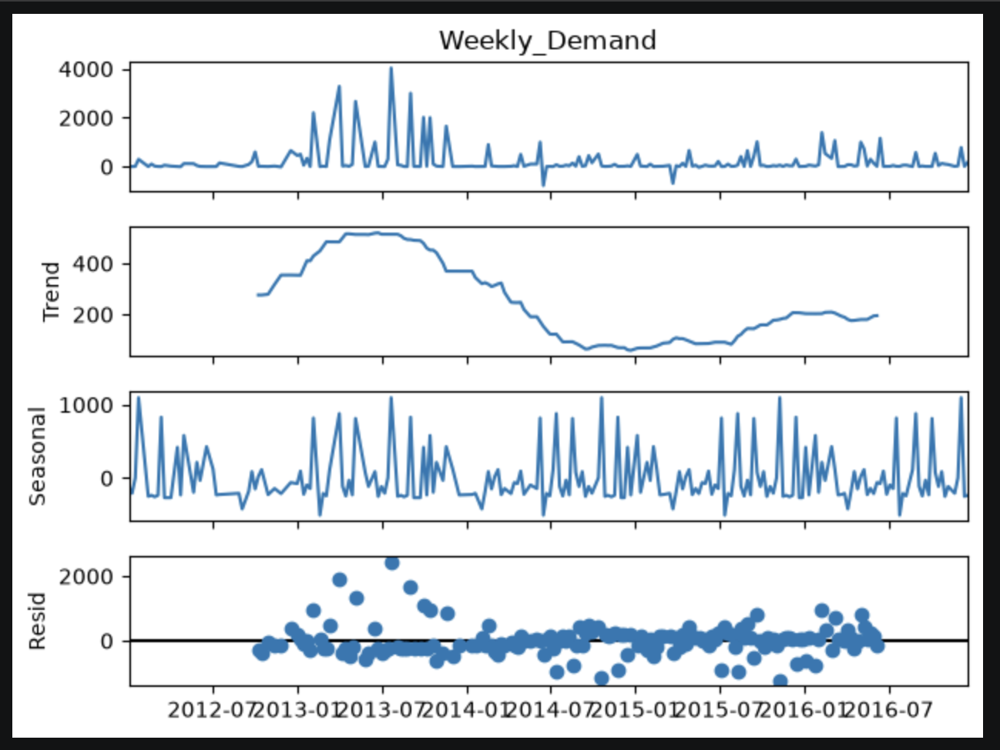
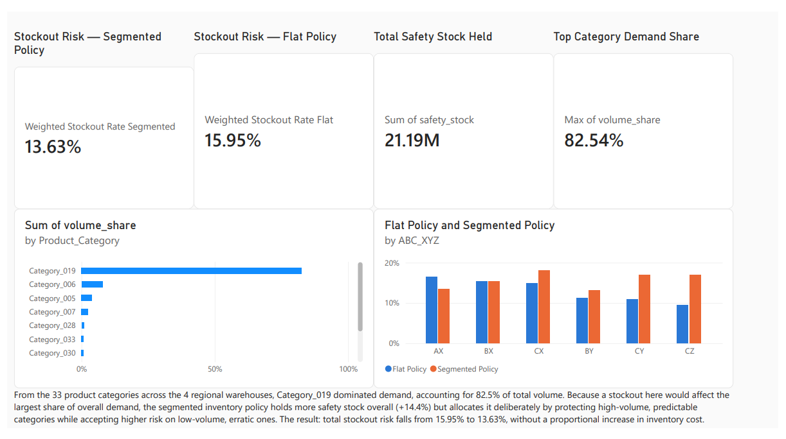

# supply-chain-forecasting-dashboard

## Phase 0 — Data Overview

Dataset: [Historical Product Demand](https://www.kaggle.com/datasets/felixzhao/productdemandforecasting)
(Kaggle) — real manufacturing demand data.

**Grain:** each row represents one product, at one warehouse, on one date, with
that day's order demand.

| Column | Description |
|---|---|
| `Product_Code` | Individual product identifier |
| `Warehouse` | One of 4 regional warehouses (`Whse_J`, `Whse_S`, `Whse_C`, `Whse_A`) |
| `Product_Category` | Broader product grouping (33 categories, e.g. `Category_019`) |
| `Date` | Order/demand date |
| `Order_Demand` | Units ordered (stored as messy text in the raw file; cleaned in Phase 1) |

**Scale:** ~1 million rows, 2,160 products, 33 categories, 4 warehouses,
spanning January 2011 – January 2017.

**Early observation:** `Category_019` appeared disproportionately dominant in
initial exploration — quantified and confirmed in Phases 3–4.

## Phase 1 — Data Cleaning

**Unparseable dates:** 11,239 rows had blank or unparseable dates, isolated
almost entirely to Warehouse A (~90% in Category_019). These contributed only
10,090 units against a total demand of 4.22 billion (0.00% of volume) — dropped
with negligible impact. Rows before: 1,048,575 → after: 1,037,336.

**Negative demand values (returns):** Order_Demand was stored as text, with
parenthesis notation `(500)` as the only marker for negative (returned) demand.
10,469 negative rows were found; 4,570 of these overlapped with the dropped
blank-date rows — a 41% correlation suggesting both issues share a root cause
(likely the same Warehouse A export/logging process, not two unrelated
problems). Of 23 extreme outlier returns identified, 21 were kept as
legitimate bulk returns (most matched to a recent large positive order for
the same product, consistent with a cancelled/returned bulk order); 2
(`Product_0366`, `Product_1250`) were capped at each product's own historical
maximum order, having failed a sanity check by exceeding their own all-time
order history.

**Missing values:** checked across `Product_Code`, `Warehouse`,
`Product_Category`, and `Order_Demand_clean` — none found.

**Duplicate rows:** 113,064 exact-duplicate rows (10.8% of the dataset) were
found. Since same-day multiple orders are a common, legitimate pattern in this
dataset, a threshold-based approach was used instead of a blanket drop: only
groups repeating **5 or more times** (a documented judgement call) were treated
as export/logging artifacts and deduplicated; low-repeat duplicates (2–4x) were
kept as plausible genuine separate orders. Net result: 1,024,856 rows
remaining — a 1.2% row reduction for only a 0.44% reduction in total demand
volume, a deliberately surgical approach rather than a naive full drop.

**Outlier check (3 std-dev, per product):** flagged per-product rather than
globally, since a single global threshold on a column this skewed would
misflag legitimate high-volume products. Products required a minimum of 10
historical orders before their bound was trusted. 92% of products (1,985 of
2,160) had at least one flagged row, broad-based across many categories rather
than concentrated in a few — consistent with genuine demand variability (bulk
orders, seasonal spikes) rather than a data quality issue. Outliers were
**not** removed or capped; the `is_outlier` flag was retained as metadata for
later reference in the forecasting and safety-stock phases.

**Aggregation to weekly demand:** cleaned daily-level transactions were rolled
up to weekly demand per product category. Daily data was too noisy to reflect
real demand signals; weekly aggregation smooths this out and matches how
supply chain planning actually operates (reorder decisions are rarely made at
daily granularity). Partial years 2011 (85 category-weeks) and 2017 (14
category-weeks) were excluded to avoid distorting later seasonal decomposition,
versus ~1,400 category-weeks in each full year (2012–2016).

## Phase 2 — SQL Analysis

Cleaned data was loaded into a local SQLite database (`sql/supply_chain.db`)
via SQLAlchemy, containing two tables: `demand_clean` (1,024,856 rows,
daily-level) and `weekly_demand` (7,082 rows, category-weekly aggregates).
Three non-trivial queries were written to demonstrate core SQL patterns.

**1. Window function — rolling 4-week average per category:**

```sql
SELECT Week, Product_Category, Weekly_Demand,
    AVG(Weekly_Demand) OVER (
        PARTITION BY Product_Category ORDER BY Week
        ROWS BETWEEN 3 PRECEDING AND CURRENT ROW
    ) AS rolling_4wk_avg
FROM weekly_demand ORDER BY Product_Category, Week
```

A 4-week window was chosen as a rough monthly smoothing signal. Verified
correct by hand-checking early rows: the window fills in progressively for
the first 3 weeks of each category, then settles into a true 4-week average.

**2. Join — each warehouse's share of category-level weekly demand:**

A CTE aggregates `demand_clean` to warehouse-weekly level, then joins against
`weekly_demand` on `(Week, Product_Category)` to compute each warehouse's
percentage share of that category's total demand for the week.

**Key finding:** some category-weeks show extreme single-warehouse
concentration — e.g. one week where `Whse_J` supplied 99.1% of
`Category_001`'s demand. This is a genuine supply-risk signal: a category
this concentrated in one warehouse has no natural backup if that warehouse
is disrupted, directly motivating the Phase 5 Monte Carlo disruption work.
Sanity-checked: warehouse percentage shares for a given category-week sum to
~100%.

**3. Aggregation — category-level summary:**

```sql
SELECT Product_Category, COUNT(*) AS num_orders, SUM(Order_Demand_clean) AS total_demand,
    ROUND(AVG(Order_Demand_clean), 1) AS avg_order_size,
    SUM(CASE WHEN is_outlier = 1 THEN 1 ELSE 0 END) AS num_outliers
FROM demand_clean GROUP BY Product_Category ORDER BY total_demand DESC
```

**Category_019** dominates with ~4.2B total demand — roughly 10x the next
largest category (Category_006, ~402M) — confirming the bulk-order
concentration already suspected in Phase 0/1 (8,341 flagged outlier rows,
far more than any other category).

**Category_033** shows a distinct demand *shape*: a low order count (1,849)
but by far the highest average order size (22,915) — a low-frequency,
high-volume-per-order pattern, different


## Phase 3 — Demand Pattern Analysis

**Coefficient of variation (CV) per category:**

Computed as std(weekly demand) / mean(weekly demand) per category, using the
`weekly_demand` table. This measures how erratic each category's demand is,
independent of its size — and feeds directly into Phase 4's XYZ segmentation
(low CV → predictable "X", high CV → erratic "Z").

Category_019 — the largest category by volume (~4.2B total demand) — has the
**lowest** CV of all 33 categories (0.205): despite dominating volume, its
demand is unusually stable and predictable. By contrast, categories like
Category_017, Category_027, and Category_010 show CV > 2 — high-volume and
high-volatility are clearly independent axes here, not correlated, which
justifies treating ABC (volume) and XYZ (variability) as separate
segmentations rather than one combined score.

**Seasonal decomposition:**

Performed using `statsmodels.seasonal_decompose` (additive model, period=52)
on aggregate weekly demand, 2012–2016.


- **Trend:** demand rises steadily from 2012, peaks around 2014–2015, then
  declines through 2016.
- **Seasonal:** a consistent, repeating annual wave — genuine calendar-driven
  seasonality, not noise.
- **Residual:** scattered tightly around zero with no visible structure —
  confirming trend and seasonality capture the bulk of the signal cleanly.

**Category-level check — is this an aggregate pattern, or one category
driving it?**

Decomposing Category_019 alone (below) produces a near-identical shape to the
aggregate — confirming that, due to its outsized volume share, Category_019
is substantially the driver of the whole-business pattern rather than a
broad effect spread evenly across all 33 categories.


For contrast, Category_017 (high CV, low volume) was decomposed the same way:



- **Scale:** Category_017 sits in the low thousands per week vs. Category_019's
  tens of millions — a genuinely small, low-volume category.
- **Trend shape:** peaks earlier (2013–2014, vs. 2014–2015) and sharper, then
  declines to well below its 2012 starting level — a materially different
  trend shape, not just a smaller version of the same curve.
- **Seasonal:** a repeating wave is present, but given the category's small
  scale and high CV (2.59), some of this may reflect volatility rather than a
  clean calendar-driven cycle.
- **Residual:** proportionally much larger relative to the signal than
  Category_019's — the decomposition captures Category_017's erratic demand
  as unexplained noise, not as trend or season.

**Interpretation:** Category_019 (low CV) decomposes cleanly into trend and
season with modest residual noise, while Category_017 (high CV) shows a
different trend timing/shape and proportionally much larger unexplained
variation. This is direct, evidenced justification for why a single flat
inventory policy would poorly serve both extremes at once — the core case
for the segmented policy built in Phase 4.

**Discount/promo effect — not applicable:** this dataset has no
discount/promotion field, unlike the originally-considered DataCo dataset.
Noted here explicitly as a scope limitation rather than silently omitted.


## Phase 4 — ABC/XYZ Segmentation

**Methodology note:** ABC segmentation here classifies by demand *volume*
(units), not revenue — this dataset has no unit price/cost field. This is a
standard substitution when financial data is unavailable, but it means a
high-volume, low-margin category could out-rank a low-volume, high-margin
one — worth flagging to anyone applying this methodology to a real inventory
decision.

**ABC — cutoffs derived from demand-ratio cliffs, not a fixed percentage:**

The dataset doesn't follow a clean 80/15/5 Pareto curve — Category_019 alone
holds 82.6% of total demand, so the standard split doesn't map onto this data.
Instead, boundaries were derived from the data itself: consecutive categories
(ranked by total demand) were compared using a demand ratio (this category's
share ÷ the next category's share). Two clear structural breaks emerged:

- Category_019 is 10.4x larger than the next-largest category (Category_006)
  — justifying a standalone A tier, despite being a single category.
- Category_030 is 9.2x larger than the next category (Category_026) —
  marking the natural end of tier B.

All other consecutive-category ratios in the top 25 fell between 1.0–2.9x —
gradual decline, not a genuine cliff — confirming these two points are real
structural breaks, not noise.

**Result:** A = 1 category (82.6% of demand), B = 6 categories
(82.6%→99.5%), C = 26 categories (remaining 0.5%). This extreme A-tier
concentration reflects genuine demand concentration in the data, not a
modelling artefact — independently confirmed by the Phase 2 SQL ranking and
the Phase 3 finding that this same category is also the most predictable of
all 33.

**XYZ — standard CV thresholds, not cliff-based:**

Unlike ABC, the CV distribution showed no equivalent cliff structure —
forcing an artificial break here would mean picking a boundary in the middle
of a smooth, gradual slope. Standard thresholds were used instead: X < 0.5
(predictable), Y < 1.0 (moderate), Z ≥ 1.0 (erratic).

**Result:** X = 5 categories, Y = 14, Z = 14 — the majority of the product
range shows moderate-to-high demand volatility.

**Combined ABC × XYZ matrix:**

| | X | Y | Z |
|---|---|---|---|
| **A** | 1 (Category_019) | 0 | 0 |
| **B** | 2 | 4 | 0 |
| **C** | 2 | 10 | 14 |

**Key findings:**
- Category_019 — 82.6% of total demand — is also the most predictable
  category in the dataset (lowest CV). The business's dominant demand driver
  is also its most stable.
- Demand volatility is concentrated almost entirely in low-volume (C-tier)
  categories; no B-tier category falls into the erratic Z bucket.
- This combined view — not visible from ABC or XYZ alone — directly
  motivates a differentiated inventory policy: AX-type categories can run
  lean safety stock, while the 14 CZ categories need proportionally the
  largest buffer relative to their own size.


## Phase 4 — Safety Stock & Reorder Point

**Concept:** safety stock is a buffer held in addition to average demand,
sized to absorb demand uncertainty during the time it takes to replenish
stock (lead time). Reorder point is the trigger level — once stock on hand
drops to this number, a new order is placed.

**Formula:**
Safety Stock = Z × σ(weekly demand) × √(lead time in weeks)
Reorder Point = (mean weekly demand × lead time in weeks) + safety stock


- **Z** — a service-level factor, expressed as the probability of *not*
  stocking out (e.g. 95% service level → Z ≈ 1.65). Higher Z means more
  buffer, lower stockout risk, higher holding cost. Z values are drawn from
  the standard normal distribution.
- **σ(demand)** — standard deviation of weekly demand per category, from
  the Phase 3 CV analysis.
- **√(lead time)** — accounts for uncertainty compounding over a longer
  replenishment window.

**Lead time:** no lead-time field exists in this dataset. A fixed assumption
of 37.5 days (5.36 weeks) was used — the midpoint of a ~30–45 day range,
grounded in the dataset's ocean freight documentation. Applied uniformly
across all categories, since lead time is a logistics/supplier
characteristic, not a policy lever the business controls per category.

**Service level (Z) — differentiated by ABC×XYZ segment:**

| Segment | Service level | Z |
|---|---|---|
| AX | 98% | 2.05 |
| BX | 95% | 1.65 |
| BY | 93% | 1.48 |
| CX | 92% | 1.41 |
| CY | 88% | 1.18 |
| CZ | 85% | 1.04 |

**Rationale:** service level was deliberately set *lower*, not higher, for
volatile low-volume (CZ) segments. Volatility is already captured
mathematically by σ in the formula — a Z-tier category gets a larger safety
stock even at a lower Z, simply because its demand is more erratic. Setting
Z itself is a separate business-policy decision: given Category_019 (the
sole AX category) drives 82.6% of total demand, stock investment is
deliberately concentrated on protecting that category, accepting more
frequent — but low-cost — stockouts on the 14 CZ categories, whose individual
contribution to total demand is negligible. In plain terms: Category_019 is
allowed to stock out roughly 1 in every 50 replenishment cycles (2%);
CZ categories, roughly 1 in every 7 (15%) — a deliberate, cheap trade-off
given how small and unpredictable they are.

**Key finding:** despite the lower Z, safety stock as a *proportion of a
category's own average demand* is still consistently higher for CZ
categories than for AX/BX — e.g. Category_017 (CZ) carries safety stock
equal to roughly 6x its average weekly demand, versus Category_019 (AX) at
roughly 1x. This confirms the policy works as intended: in absolute terms,
stock investment concentrates on the categories that matter most to the
business (Category_019 alone holds ~15.6M units of safety stock); in
relative terms, the formula still honestly reflects how much harder erratic
categories are to protect, even when the business has chosen to accept more
risk on them.

**Scope note:** safety stock protects against normal, expected demand
variation captured by σ. It does not protect against genuine shocks — a
major supplier collapse, an unexpected bulk order, a black-swan event. That
scenario is covered separately in Phase 5's Monte Carlo simulation.


## Phase 4 — Forecasting vs. Naive Baseline

**Approach:** aggregate weekly demand (2012–2016) split chronologically —
209 weeks training (2012–2015), 52 weeks held out as test (all of 2016). Two
forecasts compared on the same unseen test period.

**Naive baseline:** predicts each week of 2016 will equal actual demand from
the same week one year prior (a 52-week shift) — a zero-modelling placeholder
to benchmark against. MAE: 3,519,694 units.

**Holt-Winters (triple exponential smoothing):** models three components at
once — level (current baseline), trend (rising/falling), and seasonality
(repeating yearly pattern) — learning the strength of each from the training
data, then projecting all three forward together. Additive trend + additive
seasonal (seasonal_periods=52), fit on training data only. Additive was
chosen based on the Phase 3 decomposition: the seasonal component showed
roughly constant absolute swing size across 2012–2016, despite the trend
rising and falling substantially over the same period — swings don't scale
proportionally with the demand level, which is what an additive (rather than
multiplicative) model assumes. MAE: 2,933,655 units — a **16.7% reduction**
in forecast error versus the naive baseline.

**Interpretation:** the improvement confirms the trend and seasonality
identified in Phase 3 are genuine, exploitable patterns — a model built to
use them meaningfully outperforms one that ignores them. The improvement is
real but moderate: plotting actual vs. both forecasts shows most week-to-week
volatility remains unexplained by either method, consistent with the
substantial residual noise already observed in the Phase 3 decomposition.
This is expected — that residual represents demand variation with no
repeating structure to model, not a shortcoming of the forecasting method.

**Scope note:** forecasting was performed at the aggregate (all-category)
level, not per category, to keep this phase manageable. Category-level
forecasting — particularly for the low-volume, high-CV categories identified
in the XYZ segmentation — is a natural extension if time allows. (Phase 5
documents the specific decision to use historical mean, not per-category
Holt-Winters, for reorder point calculations.)


## Phase 5 — Monte Carlo Simulation

**Concept:** some questions are too complex to answer with a clean formula —
"given randomness in both demand *and* lead time, how often would stock
actually run out?" Monte Carlo simulation answers this by running a
simulation with random inputs thousands of times and examining the spread
of outcomes, rather than solving for a single number analytically.

One simulated trial = one hypothetical version of "a single time you had to
reorder stock." The simulation has three parts:
1. A **bootstrap demand generator** — the demand piece of the hypothetical
2. A **disruption model** — the lead-time piece of the hypothetical
3. A **replication loop** — running both together, 10,000 times per
   category, and counting what fraction of trials ended in a stockout

**Part 1 — demand-during-lead-time generator:**

Two approaches were considered for simulating demand across the ~5.36-week
lead-time window:

- **Parametric:** assume weekly demand is Normally distributed, then use the
  property that summing L Normal weeks gives Normal(mean × L, std × √L).
  This is mathematically what underpins the Phase 4 Z-score safety stock
  formula.
- **Bootstrap resampling (chosen):** randomly sample actual historical
  weekly demand values (with replacement) for each week in the lead-time
  window, sum into one lead-time-demand total, repeat thousands of times to
  build an empirical distribution.

**Rationale:** Phase 1's outlier check flagged at least one outlier row in
92% of products — concluded to reflect genuine demand variability (bulk
orders, spikes), not a data quality issue. A Normal-distribution assumption
would smooth that skew away. Bootstrapping resamples real historical values
directly, preserving it — consistent with the Phase 1 finding rather than an
independent claim of higher accuracy.

**Trade-off:** bootstrap treats each sampled week as independent, so it
won't capture any seasonality that happens to fall within a specific
lead-time window. Noted as a known limitation, not a blocker.

Implementation sanity-checked against `weekly_mean × 5.36` — matched within
0.005%.

**Part 2 — disruption model:**

Simulates the supplier occasionally taking longer than the standard 5.36-week
lead time — a shipment delay, a customs hold, a factory issue. No
disruption/delay field exists in this dataset, so this stage uses documented
judgement-call assumptions rather than data-derived values (the same
approach as the 37.5-day lead time assumption in Phase 4):

- **20% probability** a given lead-time cycle experiences a disruption
- **When disrupted**, the extra delay is drawn from an exponential
  distribution with a mean of 2 extra weeks — chosen over a uniform delay
  because real-world disruptions tend to be right-skewed (most delays short,
  a few severe), which an exponential distribution captures naturally

This is a reasonable modelling choice, not an evidenced one — not validated
against real disruption data. Sanity-checked: simulated output showed ~20%
of trials disrupted, with an average extra delay of ~2.0 weeks, matching
the input assumptions.

**Design decision — reorder point uses historical mean, not per-category
Holt-Winters:**

Phase 4's Holt-Winters model was fitted on aggregate demand (summed across
all 33 categories) to validate the forecasting methodology itself, beating a
seasonal naive baseline by 16.7% MAE. Per-category reorder points here use
each category's historical mean weekly demand instead of an individual
Holt-Winters forecast. Extending Holt-Winters to all 33 categories
individually was considered but scoped out: 26 of 33 categories are
low-volume "C"-tier with thin, sparse weekly data, risking unstable seasonal
parameter estimates without per-category validation — not feasible within
project timeline. A deliberate scope decision, not a gap left unaddressed; a
natural extension for future iteration.

**Part 3 — replication loop & policy comparison:**

Runs both the bootstrap demand generator and disruption model together,
10,000 times per category, under two competing inventory policies:

- **Segmented policy:** the ABC/XYZ-differentiated Z-scores from Phase 4
  (2.05 for AX down to 1.04 for CZ)
- **Flat policy:** a single uniform Z = 1.65 applied to every category,
  regardless of segment — the counterfactual "do nothing differently"
  baseline

For each trial, actual lead time = base lead time + any disruption delay;
if simulated demand during that window exceeds the reorder point, it's
recorded as a stockout. Two outputs are compared per category: **stockout
rate** and **total safety stock held** (the holding-cost side of the
trade-off).

**Volume-weighting:** a stockout on Category_019 matters far more to the
business than one on a category whose total demand is a few hundred units.
Category-level stockout rates were therefore combined into a single
volume-weighted rate: `Σ(rate_i × volume_share_i)` across all 33 categories
— not a simple average, which would treat every category as equally
important regardless of size.

**Results:**

Simple (unweighted) average across all 33 categories: the segmented policy
performs *worse* than flat on 32 of 33 categories — expected, since only the
AX segment (Z=2.05) holds more safety stock than the flat baseline's 1.65;
every other segment's differentiated Z is lower.

Volume-weighted (the meaningful comparison, given Category_019 alone is
~82.6% of volume):

| Metric | Segmented policy | Flat policy |
|---|---|---|
| Volume-weighted stockout rate | **13.63%** | 15.95% |
| Total safety stock held | 21,194,774 | 18,534,933 |

The segmented policy holds **14.4% more** total safety stock, for a **2.3
percentage point** reduction in volume-weighted stockout risk.

**Interpretation:** on a raw category-count basis, the segmented policy
looks worse — most categories individually get a lower service level than
the flat baseline. But weighted by actual business impact, it targets
protection exactly where it matters: Category_019, the single category
responsible for over four-fifths of total demand. This is the core
justification for a segmented policy over a uniform one — not "more
inventory everywhere," but inventory allocated deliberately by consequence,
not by category count.

## Phase 6 — Power BI Dashboard

The final deliverable is a single-page executive summary dashboard, built in
Power BI Desktop for a planning-manager audience. Deliberately scoped as one
focused page rather than a multi-page dashboard: deeper supporting analysis
(seasonal decomposition, methodology caveats) belongs in this README, not in
the dashboard itself — Power BI is used here strictly for the final summary
a planning manager would actually look at.

**Data model:**

A star schema with two tables:
- **`weekly_demand`** (fact table, 7,082 rows) — Week, Product_Category,
  Weekly_Demand
- **`category_profile`** (dimension table, 33 rows, one per category) — built
  by merging `segmentation_with_policy.csv` (ABC/XYZ segment, safety stock,
  reorder point, flat-policy equivalents, CV, mean/std demand, Z-score) with
  `monte_carlo_results.csv` (segmented and flat stockout rates, volume share)
  via a Power Query merge

Related many-to-one on `Product_Category`, keeping the model to two clean
tables rather than three overlapping ones.

**DAX measures:**

Power BI's default aggregations (Sum/Average) would treat all 33 categories
equally, rather than weighting by their actual share of demand — so two
custom measures calculate the volume-weighted stockout rates directly:

```dax
Weighted Stockout Rate Segmented =
SUMX(category_profile, category_profile[stockout_rate_segmented] * category_profile[volume_share])

Weighted Stockout Rate Flat =
SUMX(category_profile, category_profile[stockout_rate_flat] * category_profile[volume_share])
```

**Dashboard layout (top to bottom):**

1. **Four KPI cards:** Stockout Risk — Segmented Policy (13.63%), Stockout
   Risk — Flat Policy (15.95%), Total Safety Stock Held (21.19M units), Top
   Category Demand Share (82.54%)
2. **Clustered bar chart** — volume share by category, top 10, showing
   Category_019 dominating at 82.5% of total demand
3. **Clustered column chart** — segmented vs. flat policy safety stock by
   ABC×XYZ segment, across the 6 non-empty combinations (AX, BX, BY, CX, CY,
   CZ) — matching the ABC×XYZ matrix from Phase 4
4. **Narrative text box:**
   > From the 33 product categories across the 4 regional warehouses,
   > Category_019 dominated demand, accounting for 82.5% of total volume.
   > Because a stockout here would affect the largest share of overall
   > demand, the segmented inventory policy holds more safety stock overall
   > (+14.4%) but allocates it deliberately — protecting high-volume,
   > predictable categories while accepting higher risk on low-volume,
   > erratic ones. The result: total stockout risk falls from 15.95% to
   > 13.63%, without a proportional increase in inventory cost.

Cross-filtering between the two charts and the KPI cards was disabled, so
clicking a bar doesn't distort the summary totals — each visual is intended
to be read independently.



Full report exported to [`report/Report.pdf`](report/Report.pdf) and
[`report/Report.png`](report/Report.png).

