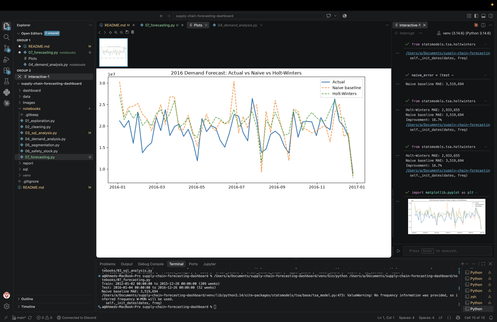
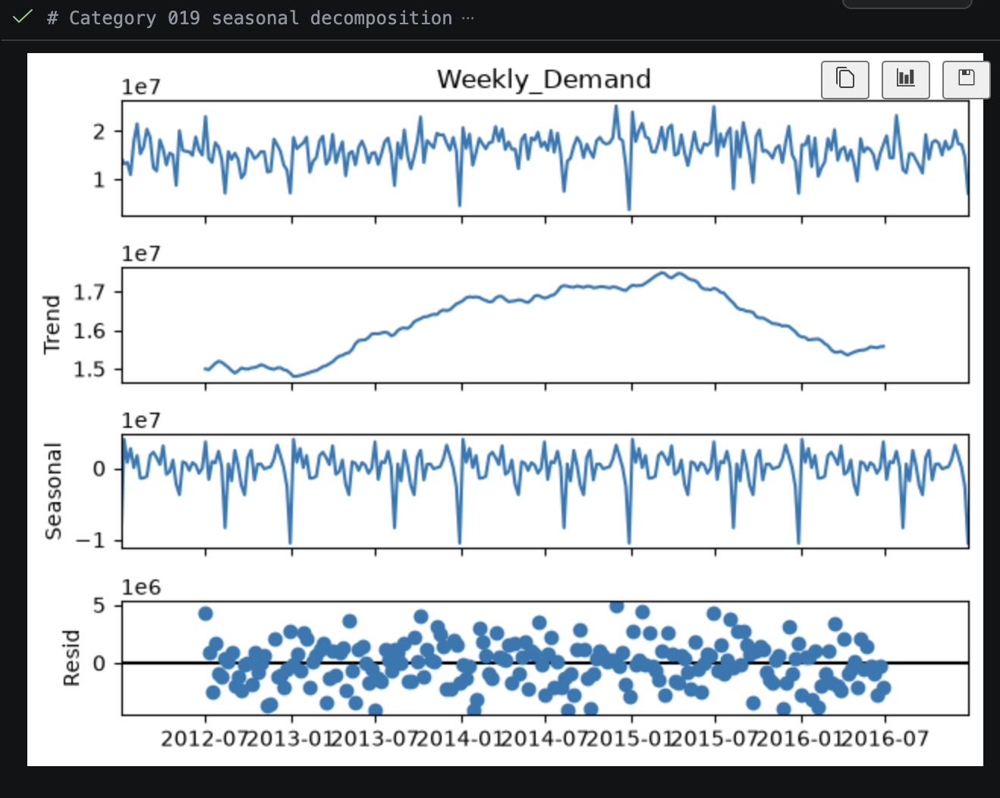

# supply-chain-forecasting-dashboard

## Phase 0

GOALS:

1. Download the dataset

2. confirm what's actually in it

3. Spot anything broken or unusual early (malformed dates,weird outliers,missing fields) 

Raw Columns:

Product_Code - which specific product this row is about 

Warehouse - which of the 4 regional warehouses this demand went through (Whse_J, Whse_S , Whse_C , Whse_A)

Product_Category - the broader group the product belongs to (e.g. Category_019) - 33 of theses in total

Date - the day this order/demand happened

Order_Demand - how many units were orderd (was stored as messy test but cleaned it)

each row = "this product, at this warehouse, on this date, had this much demand."

Size and scope - 1 million row, 2,160 different products, 33 different catageories and 4 warehouses covering Jan 2011 to Jan 2017

Data sourced from a manufacturing warehouse 

Category_019 seems too disproportionately dominate

## Phase 1

✅ Date parsing + blank-date rows dropped (documented, justified)
✅ Negative demand values investigated and handled (21 kept, 2 capped)
⬜ Duplicate rows
⬜ General missing-value check (other columns besides Date)
⬜ 3-std-dev outlier check (broader pass, beyond just the 23 you already handled)
⬜ Aggregate to weekly demand per category → save to data/processed/

Data cleaning, SQL Loading & Demand Pattern Analysis

1. Clean the raw dataset - handle the unparseable dates, decide how to treat the negative order demand values, address the zero-demand rows. Exclude partial year dates from any time series/seasonal work

unpareseale dates:

- its checking whether a raw string can be interpreted as a date at all.
it usually becomes NaT when the values is:

1. Blank/missing (empty string or a literal Nan)
2. Malformed (e.g. 00/00/0000 ), as stray placeholder, mixed date formats pandas can't reconcile
3. Genuinely impossible as a calendar date (day 32,month 13 rare but possible in messy exports)

(this doesnt include dates outside our expected order timeline we will correct that later on)

for some reason the unparesable dates seem to be grouped in continuous blocks. Likely an export issue rather than random data loss

Seems that all the unparesable dates came from Warehouse A and over 90% of the product category affected was cat019. However the product demand was extremely low of 10,090 units and compared to total demand of 4.22 billion this contributes to 0.00% so we can ignore the blank dates rows. (11,239 blank date rows)

Also order demand values that contained () was the only sign for negative orders essentially product returns

Rows before: 1048575, after: 1037336 (after decision to remove unparseable dates)

For negative rows:

1. Do negative rows cluster?
2. What's the magnitude 
3. Do they trace to specific products?
4. Revisit any suspicious numbers 

we found 10,469 negative rows and of that 4570 rows were inside the balnk date rows that I dropped. This means 41% of the blank date rows were negative demand rows. Therefore there is a correlation between theses in the same subset of records so this was likely from the same export/logging process in Warehouse A rather than two different unreleated issues.

23 extreme outliers (21 rows expect product 0366 and 1250 will be included). As theses two failed a sanity check due to exceeding all time order history that the other 21 passed. So instead of removing theses rows we will cap the max product demand.

Checking for duplicates - 113,064 rows that are duplicates. Thats around 10.8% of the entire dataset. (Exact product,in this exact warehouse,was ordered this exact quantity, on this exact same day)

By keeping the low repeat duplicates and removing high repeat duplicates since multiple orders in a day is common in the dataset, we have around 1,024,856 rows left. (1.2% removed and demand volume only decreased by 0.44%)

Looking at positive demand outliers seems like 1985 of 2160 have at least one outlier flagged. (92% of products) This represents real demand behaviour as this 

2. Document the high volume SKU pattern - Cate 019 80% demand concentration from three products 

3. Aggregate demand data - roll up cleanned transactions to weekly demand per product category

aggregate - combine multiple data into a single summarised value

Excluded weeks from 2011 and 2017 as this was partial years (85 and 14 category weeks respectively vs 1400 full years) this will help to avoid disorting seasonal decomposition.

 - converted into weeks instead of daily data as there is quite alot of noise in daily data that doesnt really reflect real demand signals.So aggregating this into weeks smooths the trend

 - another reason for the conversion was because this matches how supply chain planning actually works 

 ## PHASE 2

Python -> SQLAlchemy -> SQLite

SQLite - is the database which we saved as sql/supplychain.db.It understands how to execute SQL queries against it

SQLAlchemy - a python library thats acts as a translator/connector between your python script and some database. 

Python - where you write the actual code, using SQLAlchemy as the bridge

 Load into SQLite - via SQLAlchemy and write at least three non trivial SQL queries.

- Two tables are in SQLite (1. demand clean (1M+ rows, daily-level,fully cleaned) 2.weekly_demand (7,082 rows, aggregated))

- We calculate a 4 week average as this is roughly a month 

 1. Window function - functions that perform calculations across a set of rows

 2. A join - next up. Combines information across your tables or categories/warehouses with in one table

 3. An aggregation - grouping and summarising (e.g. total demand by warehouse, or which categories have the most volatile demand)

## PHASE 3 - DEMAND PATTERN ANALYSIS
Analyse demand patterns - seasonal decompostion per category, cofficient of variation per category

1. Coefficient of variation (CV) per category - measures how erratic each category's weekly demand is.
    It feeds directly into XYZ segmentation next phase (low CV = 'X'/predictable, high CV = 'Z'/erratic)

We can see that Category_019 has the lowest Coefficient of variation of 0.205 despite being having the highest product demand, which means its the most stable/predictable of all 33 categories. So category_19 is a strong canditate for high volume,low safety stock policy later on.

Compare to categories like 017/027/016 will likely need a higher safety stock relative to their volume, precisely because they're so unpredictable.

2. Seasonal decomposition - checks whether demand shows repeating yearly or monthly patterns (trend,seasonality, residual noise), using the weekly demand table (essentially is it going up or down)

    Seasonal decomposition is split into three components:
    1. Trend - the long term direction (is demand increasing or decreasing over next 5 years)
    2. Seasonal - a repeating pattern at a fixed interval (e.g. is there the same spike at each point of the year)
    3. Residual - whatsever left over once trend and seasonality are removed.(essentially the "noise")

From the image above we plotted 4 graphs, 1. showing weekly demand 2. Showing the trend 3. Showing the Seasonal changes 4. The residual which is what is left when removing trend and seasonal data

1. Weekly Demand - This is the total demand per week across from 2012 - 2016. There is alot of noise going up and down whilst averaging around 1 - 2.5 x10 ^7

2. Trend - Total Demand readily increases from 2012 to around 2015 which there is a peak. Then starts to decline through 2016. 

3. Seasonal - There is a consistent repeating wave pattern throughout the year so there is seasonlity here

4. Resid (Residual) - This is essentially the leftover, there is no visual pattern other than most of the points scattered near the centreline 0. This is a good sign as that means the trend and seasonal graphs capturated all the structured part of the signal.

As category 019 has the highest demand (10x the demand of the next category), we want to a seasonal decomposition soley for this category to analyse any trends.

This graph is essentially identical to the graph before which signify that this pattern is substantially largely driven by category_019

Now also checking another category that had a high coefficient of variance (CV) which is Category_017

Weekly_Demand — first thing to notice: the scale. Category_017 sits in the low thousands (0–4000), versus Category_019's tens of millions. This is a small, low-volume category. The shape also looks spikier and choppier relative to its own scale than Category_019 did.

Trend — Category_017's trend rises from 2012, peaks around 2013–2014 (earlier than Category_019's 2014–2015 peak), then falls but look at the shape: it's a much sharper, narrower peak, and it declines to a much lower level by 2016 than where it started, rather than settling back near its original level. That's a meaningfully different trend shape, not just the same curve at a smaller scale.

Seasonal — the repeating spiky wave is present here too, similar in general character to Category_019's, though given the small scale of this category, some of what "seasonal" is capturing here may really be reflecting its high volatility (consistent with its CV of 2.59) rather than a clean calendar-driven cycle.

Residual — noticeably larger relative to the signal than Category_019's residual was (spikes up to ~2000 against a series that peaks around 4000) — proportionally much noisier. Category_017 is erratic, and this decomposition is showing that erraticism as residual noise the model can't cleanly attribute to trend or season.

Category_019 (low CV) decomposes cleanly into trend + season with modest residual noise, while Category_017 (high CV) shows a different trend timing/shape and proportionally much larger unexplained residual variation. That's a solid, evidenced justification for why a flat, uniform inventory policy would poorly serve both extremes at once

3. Discount/promo effect - not applicable here since has no discound field. This is a limitation as this is a legitmate scope gap.

## Phase 3 — Demand Pattern Analysis (COMPLETE)

**Coefficient of variation (CV) per category:**
- Computed as std(weekly demand) / mean(weekly demand) per Product_Category, using the `weekly_demand` table.
- Category_019 (the largest category by volume, ~4.2B total demand) has the *lowest* CV of all 33 categories (0.205) — despite dominating volume, its demand is comparatively stable and predictable.
- Categories such as Category_017, Category_027, and Category_010 show CV > 2 — high-volatility, low-predictability demand.
- This directly feeds Phase 4's XYZ segmentation (low CV → "X"/predictable, high CV → "Z"/erratic). Confirms CV and total volume are independent axes, not correlated — justifying separate ABC (volume) and XYZ (variability) segmentation rather than one combined score.

**Seasonal decomposition:**
- Performed using `statsmodels.seasonal_decompose` (additive model, period=52) on aggregate weekly demand (2012–2016).
- Aggregate demand shows a clear multi-year trend (rising 2012→2015, declining 2015→2016) and a consistent repeating annual seasonal pattern.
- Category-level check: decomposing Category_019 alone shows a near-identical trend and seasonal shape to the aggregate — confirming this single category, due to its outsized volume share, is the primary driver of the aggregate pattern rather than a broad-based effect across all categories.
- By contrast, a high-CV category (Category_017) shows a different trend shape (earlier, sharper peak; steeper decline) and proportionally much larger residual noise — demonstrating that demand behaviour is genuinely heterogeneous across categories, and supporting the case for category-specific inventory policies over a flat uniform policy.

**Discount/promo effect — not applicable:**
- This dataset (Historical Product Demand) has no discount/promotion field, unlike the originally-considered DataCo dataset. Noted here explicitly as a scope limitation rather than silently omitted.

## PHASE 4 - ABC/XYZ segmentation 

ABC segmentation here uses order volume (units) as the value proxy, since no price/cost field exists in this dataset. This is a simplification of standard value-based ABC analysis (which typically uses revenue = volume × unit price); the relative ranking of categories may differ if true monetary value were available.

From phase 3 gave us two separate lens looking at volume and predictability (CV). This can be used for PHASE 4 to make actual decision framework

1. ABC segmentation - classify each category by value/volume (A = the few categories driving most of the business, C = many low-volume ones )

    The dataset does not follow a clean 80/15/5 curve as Category_19 alones holds 82.6% of the total demand so the standard pareto heustric does not map cleanly onto this data. Therefore I will follow a natural breakpoint approach instead.

### ABC segmentation — cutoffs derived from demand-ratio cliffs, not a fixed percentage

Rather than applying the conventional 80/15/5 Pareto split as a fixed target, ABC boundaries
were derived from the data itself: consecutive categories (ranked by total demand) were
compared using a demand ratio (this category's share ÷ next category's share). Two clear
structural breaks emerged among the top categories by volume:

- Category_019 is 10.4x larger than the next-largest category (Category_006) — justifying
  a standalone A tier, despite being a single category.
- Category_030 is 9.2x larger than the next category (Category_026) — marking the natural
  end of tier B.

All other consecutive-category ratios in the top 25 fell between 1.0–2.9x, i.e. gradual
decline rather than a genuine cliff — confirming these two points are real structural
breaks, not noise.

**Result:** A = 1 category (82.6% of demand), B = 6 categories (82.6%→99.5%),
C = 26 categories (remaining 0.5%). The extreme A-tier concentration (single category,
>80% of volume) reflects genuine demand concentration in this dataset, not a modelling
artefact — confirmed by Query 3 (Category_019's total demand) and the CV analysis (same
category also shows the lowest, most predictable CV of all 33 categories).

### XYZ Segmentation

2. XYZ segmentation - classify each category by CV (X = predictable, Z = erratic) 

- This is different from ABC (80/15/5 Convention). The data was far more concentrated so I had to derive cutoffs from actual cliffs. Compared to XYZ is closer to the opposite as CV doesnt show a cliff structure, forcing artificial "cliffs" here would mean picking a boundary in the middle of a smooth, gradual slope 

**Result:** X = 5 categories, Y = 14, Z = 14 — the majority of the product range shows
moderate-to-high demand volatility.

3. Combine into a 3x3 ABC-XYZ matrix - e.g. "AX" categories (high volume and high predictability)
### COMBINATION OF ABC-XYZ Segmentation

| | X | Y | Z |
|---|---|---|---|
| **A** | 1 (Category_019) | 0 | 0 |
| **B** | 2 | 4 | 0 |
| **C** | 2 | 10 | 14 |

**Key Findings:**

- Category_019 was responsible for 82.6% of the total demand and was also the most predictable category in the dataset (having the lowest coefficient of variation)
- Therefore the business dominant revenue driver is also its most stable.
- Conversely, demand volatility is concentrated almost entirely in low-volume (C-tier) categories no B-tier category falls into the erratic Z bucket. This combined view, not visible from ABC or XYZ alone, directly motivates differentiated inventory policy: AX-type categories can run lean safety stock, while the 14 CZ categories need proportionally the largest buffer relative to their size.

4. Safety stock formula - calculate a data driven buffer stock level per segment rather than one flat rule for everything 

Concept explained - Safety stock is a buffer held in addition to avearge demand, sized to absorb demand uncertainty during the time it takes to replenish stock (lead time)

LEAD TIME - Time between placing the reorder and that replenishment stock arriving. (Logistics/Supplier characteristic)

Formula:

Safety Stock = Z × σ(demand) × √(lead time)

Z = a "service level" factor — how much buffer you want, expressed as a probability of not stocking out (e.g. 95% service level → Z ≈ 1.65). Higher Z = more buffer = lower stockout risk = higher holding cost. (essentially how much stockout risk you are willing to accept for that segment)

σ(demand) = standard deviation of weekly demand — you already have this, it's std_demand in your CV table.

√(lead time) = accounts for the fact that uncertainty compounds over a longer replenishment window.

Z should vary by segment (e.g. your one AX category (high volume, highly predictable, and per Query 2, carries real single-warehouse concentration risk) might reasonably get a higher service level target than a CZ category, since a stockout there is more costly to the business.)

I think it makes more sense to accept the volatility and low volume together, as the majority of the revenue was from cat_019, not from the low category, so having a high safety stock for those categories will be a waste of money

The values of Z numbers come from the standard normal distribution.

SERVICE LEVEL EXPLAINED:
it's not "keep 85% of something in stock" — it's "accept that this category will stock out in roughly 1 out of every ~7 lead-time cycles (15% of the time), because that's a cheap trade-off given how small and unpredictable this category is; but for Category_019, only accept a stockout in roughly 1 out of every 50 cycles (2%), because that one actually matters."

REORDER POINT
Reorder Point = expected demand during lead time + safety stock
It's the trigger level — the moment your stock on hand drops to this number, you place a new order, and the two components together mean you're covered both for the expected sales during the wait (the demand × lead time part) and for unexpected spikes above that average (the safety stock part, scaled by how much stockout risk you decided was acceptable for that segment).

Safety stock only protects against normal, expect everyday demand thats captured by the standard deviation of demand. This doesnt protect from genuine abnormal shock like major supplier collapse or a huge unexpected bulk order or a black swan event. This will be cover in phase 5 of the Monte Carlo simulation.

## SUMMARY OF PHASE 4

### Safety stock & reorder point

**Formula:** Safety Stock = Z × σ(weekly demand) × √(lead time in weeks)
Reorder Point = (mean weekly demand × lead time in weeks) + safety stock

**Lead time:** No lead-time field exists in this dataset. A fixed assumption of 37.5 days
(5.36 weeks) was used — the midpoint of a ~30–45 day range, grounded in the dataset's
ocean freight documentation. Applied uniformly across all categories, since lead time is
a logistics/supplier characteristic, not a policy lever the business controls per category.

**Service level (Z) — differentiated by ABC×XYZ segment, not a single flat rule:**

| Segment | Service level | Z |
|---|---|---|
| AX | 98% | 2.05 |
| BX | 95% | 1.65 |
| BY | 93% | 1.48 |
| CX | 92% | 1.41 |
| CY | 88% | 1.18 |
| CZ | 85% | 1.04 |

**Rationale:** service level (and therefore Z) was deliberately set *lower* for volatile,
low-volume segments (CZ) rather than higher. Volatility is already captured mathematically
by σ in the formula — a Z-tier category receives a larger safety stock even at a lower Z,
simply because its demand is more erratic. Setting Z itself is a separate business-policy
decision: given Category_019 (the sole AX category) drives 82.6% of total demand, stock
investment is deliberately concentrated on protecting that category and other higher-tier
segments, while accepting more frequent (but low-cost) stockouts on the 14 CZ categories,
whose individual contribution to total demand is negligible. This reflects the project's
core thesis — differentiated, cost-conscious policy beats a single uniform rule.

**Key finding:** despite the lower Z, safety stock as a *proportion of a category's own
average demand* is still consistently higher for CZ categories than for AX/BX — e.g.
Category_017 (CZ) carries safety stock equal to roughly 6x its average weekly demand,
versus Category_019 (AX) at roughly 1x. This confirms the policy is working as intended:
in absolute terms, stock investment concentrates on the categories that matter most to
the business (Category_019 alone holds ~15.6M units of safety stock); in relative terms,
the formula still honestly reflects how much harder erratic categories are to protect,
even when the business has chosen to accept more risk on them.

**Note on ABC methodology:** ABC segmentation here uses order volume (units), not revenue,
since no price/cost field exists in this dataset. This is a simplification of standard
value-based ABC analysis; true monetary-value rankings may differ from the volume-based
rankings used throughout this project.

5. Forecasting - build a simple forecast and compare it against a naive basline

The split the dataset timeline into two separate sections:

1. train (2012 - 2015, 209 weeks) to build forecast from
2. test (all of 2016, 52 weeks) (so we can see how well our forecast has predicted this as this is unseen data to judge the forecast fairly)

naive_forecast - for each week in 2016, this says "predict the same number as exactly one year earlier" No modelling just a placeholder guess to serve as your baseline (this is a basic prediction where we are predicting 2016 to look like 2015)

MAE (Mean Absolute Error) - MAE does not tell you whether you over- or under-forecasted. As this has abs it strips away direction so just has magnitude of how far away you predicted. 

MAE Naive_forecast - 3,519,694 (essentially a benchmark on how bad a zero-effort guess is)

NEXT I WILL BUILD A BRAND-NEW FORECAST - HOLT-WINTERS that uses a trend and seasonality. (completely new set of predictions and compare the MAE results to the naive)

HOLT-WINTERS (also know as triple exponential smoothing) is a forecasting method that explicity models three things at once - level(current baseline amount), trend (is it rising or falling), and seasonal (repeating yearly pattern). It uses the training data to learn how strong each of those three effects is, then projects all three forward together to generate the forecast.

### Forecasting vs. naive baseline

**Approach:** aggregate weekly demand (2012–2016) split chronologically — 209 weeks
training (2012–2015), 52 weeks held out as test (all of 2016). Two forecasts compared
on the same unseen test period.

**Naive baseline:** predicts each week of 2016 will equal actual demand from the same
week one year prior (52-week shift). MAE: 3,519,694 units.

**Holt-Winters (triple exponential smoothing):** additive trend + additive seasonal
(seasonal_periods=52), fit on training data only. Additive was chosen based on the
Phase 3 seasonal decomposition — the seasonal component showed roughly constant
absolute swing size across 2012–2016, despite the underlying trend rising and falling
substantially over the same period, indicating swings don't scale proportionally with
the demand level. MAE: 2,933,655 units — a 16.7% reduction in forecast error versus
the naive baseline.

**Interpretation:** the improvement confirms the trend and seasonality identified in
Phase 3 are genuine, exploitable patterns — a model built to use them meaningfully
outperforms a method that ignores them. The improvement is real but moderate: plotting
actual vs. both forecasts shows most week-to-week volatility remains unexplained by
either method, consistent with the substantial residual noise already observed in the
Phase 3 decomposition. This is expected — that residual represents demand variation
with no repeating structure to model, not a shortcoming of the forecasting method.

**Scope note:** forecasting was performed at the aggregate (all-category) level, not
per category, to keep this phase's scope manageable. Category-level forecasting —
particularly for the low-volume, high-CV categories identified in Phase 4's XYZ
segmentation — is a natural extension if time allows.

## PHASE 5 - Monte Carlo Simulation (Supplier delay/distruption modelling)

## PHASE 6 - POWER BI dashboard build 